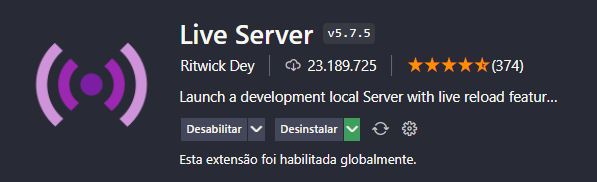

# Desafio HTML, CSS e GIT

O Desafio tem como objetivo testar seus conehcimentos referente a escrita semantica do HTML e a estilização das tags com as folhas de estilos CSS.

## Site a ser implementado

- O leiaute a ser implementado deverá corresponder a imagem abaixo, você pode consultar o mesmo no figma, para isso e so clicar na imagem.

## Dicas

- Como você não irá utilizar nenhum fremework para rodar seu site recomendamos utilizar a extensão do vsCode liveServer
  
  
 Caso não possua a extensão instale e verifique o modo de usar logo abaixo, lembrando que essa extensão ira rodar seu html no navegador e irá atualizar em tempo real suas alterações.

### Links uteis para seu desenvolvimento.
- [Link 1](https://desenvolvimentoparaweb.com/css/bem/)
- [Link 2](https://cssgradient.io/)

### Considerações
O desafio ja possui uma estrutura de pastas e arquivos que irão te auxiliar no desenvolvimento você pode tomar os mesmos como base ou não.

Importante ressaltar que você deverá realizar o clone do projeto criar uma branch como o nome de exemplo: (feature/PL/teste-html-css), as iniciais que estão em maisculos deve corresponder as do seu nome, após o termino do desenvolvimento você deverá realizar o Pull Request das suas alterações. Com isso a conclusão do desafio estara pronta para ser avaliada.

## Bom desafio!

Vinicius Lima

